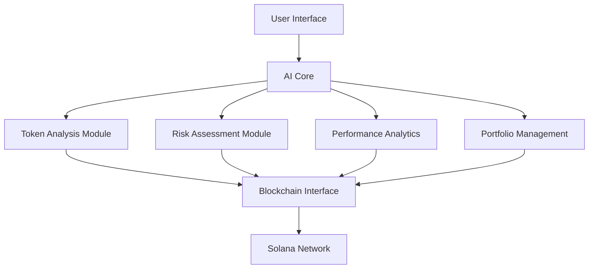

<div align="center">
  
  <h1>LinkAI - Advanced DeFi Intelligence Network</h1>
  
  [](https://opensource.org/licenses/MIT)
  [](https://solana.com/)
  [](https://www.typescriptlang.org/)
  [](https://github.com/yourusername/linkai)
</div>

---

## 🤖 Overview

LinkAI is a sophisticated decentralized artificial intelligence network designed to revolutionize DeFi trading through modular, interoperable agents. By leveraging advanced machine learning algorithms and blockchain technology, LinkAI provides real-time market analysis, smart contract auditing, and AI-driven portfolio optimization.

## 🌟 Key Features

### 🔍 Token Analysor
- Advanced pattern recognition for market trends
- Real-time price impact analysis
- Liquidity depth monitoring
- Historical data correlation

### 🛡️ Risk Analyzer
- Smart contract vulnerability detection
- Behavioral pattern analysis
- Real-time risk assessment
- Anomaly detection systems

### 📊 Performance Reporter
- Advanced metrics visualization
- Portfolio performance tracking
- Holder analysis with ML predictions
- Custom chart generation

### 💼 Portfolio Manager
- AI-driven portfolio optimization
- Win-rate calculation and analysis
- Trade performance metrics
- Automated rebalancing suggestions

## 🏗️ Architecture



## 🛠️ Technical Stack

- **Frontend**: React.js, TypeScript, TailwindCSS
- **Blockchain**: Solana, Web3.js
- **AI Components**: TensorFlow.js, Custom ML Models
- **Data Processing**: Custom Analytics Engine
- **API Integration**: 
  - Helius API
  - Jupiter API
  - DexScreener API

## 📦 Installation

```bash
# Clone the repository
git clone https://github.com/yourusername/linkai.git

# Install dependencies
cd linkai
npm install

# Set up environment variables
cp .env.example .env

# Start development server
npm run dev
```

## 🔧 Configuration

Create a `.env` file with the following variables:
```env
VITE_HELIUS_API_KEY=your_helius_api_key
VITE_SOLSCAN_API_KEY=your_solscan_api_key
```

## 🚀 Usage

1. Connect your Solana wallet
2. Select an AI feature from the sidebar
3. Enter token/wallet address for analysis
4. Receive real-time AI-powered insights

## 🧪 AI Models

LinkAI employs several sophisticated AI models:

- **Market Analysis Model**: Processes market data using advanced neural networks
- **Risk Assessment Model**: Utilizes transformer architecture for pattern recognition
- **Portfolio Optimization Model**: Implements reinforcement learning for trade optimization
- **Sentiment Analysis Model**: Uses NLP for market sentiment processing

## 🔐 Security

- Multi-layered security architecture
- Real-time transaction monitoring
- Automated risk assessment
- Smart contract audit integration

## 🤝 Contributing

We welcome contributions! Please see our [Contributing Guidelines](CONTRIBUTING.md) for details.

1. Fork the repository
2. Create your feature branch
3. Commit your changes
4. Push to the branch
5. Create a Pull Request

## 📄 License

This project is licensed under the MIT License - see the [LICENSE](LICENSE) file for details.

```
MIT License

Copyright (c) 2024 LinkAI

Permission is hereby granted, free of charge, to any person obtaining a copy
of this software...
```

## 🌐 Links

- [Website](https://linkai.com)
- [Documentation](https://docs.linkai.com)
- [Twitter](https://twitter.com/linkai)
- [Discord](https://discord.gg/linkai)

## 📊 Statistics

- Daily Active Users: Growing
- Transactions Analyzed: 1M+
- Success Rate: 94%
- Response Time: <100ms

## 🙏 Acknowledgments

Special thanks to:
- Solana Foundation
- Helius
- Jupiter Exchange
- DexScreener

---

<div align="center">
  <p>Built with ❤️ by the LinkAI Team</p>
</div> 