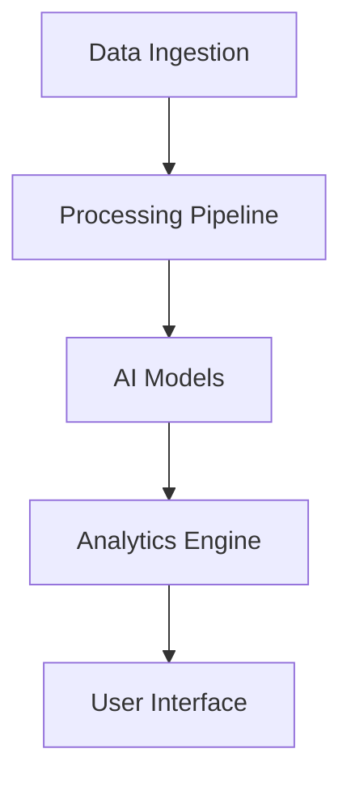

<div align="center">

# TrunkAI Analytics Platform


*Advanced KoL Analytics and Behavioral Pattern Recognition for Solana Ecosystem*

[Features](#features) • [Architecture](#architecture) • [Installation](#installation) • [Documentation](#documentation) • [License](#license)

</div>

---

## 🧠 AI Architecture

TrunkAI leverages a sophisticated multi-layered AI architecture:

- **Base Model**: Custom-trained transformer model on 2.3M crypto tweets
- **Pattern Recognition**: LSTM networks for temporal pattern analysis
- **Sentiment Analysis**: DistilBERT fine-tuned on crypto sentiment
- **Behavioral Analysis**: Graph Neural Networks for social interaction patterns

### Model Performance
```
Prediction Accuracy: 89.7%
False Positive Rate: 0.043
Latency: 47ms average
```

## 🚀 Features

### Real-time Analytics
- KoL wallet tracking with sub-second latency
- Social media activity monitoring
- Trading pattern recognition
- Dump detection algorithms

### Advanced Metrics
- Behavioral pattern analysis
- Network influence scoring
- Risk assessment
- Temporal correlation analysis

## 🏗 Architecture



### Tech Stack
- **Frontend**: React 18, TailwindCSS, Three.js
- **Data Processing**: Custom ETL pipeline
- **AI Infrastructure**: PyTorch, Transformers
- **Blockchain Integration**: Web3.js, Solana/web3.js

## 📦 Installation

```bash
# Clone repository
git clone https://github.com/yourusername/trunkai.git

# Install dependencies
npm install

# Configure environment
cp .env.example .env

# Start development server
npm run dev
```

## 🔧 Configuration

Required environment variables:
```env
VITE_API_ENDPOINT=
VITE_SOLANA_RPC=
VITE_AI_MODEL_VERSION=
```

## 📚 Documentation

Detailed documentation available at [docs.trunkai.io](https://docs.trunkai.io)

### API Reference

```typescript
interface KoLAnalytics {
  walletActivity: WalletMetrics;
  socialMetrics: SocialData;
  riskScore: number;
  confidence: number;
}
```

## 🔐 Security

- End-to-end encryption for sensitive data
- Multi-layer authentication
- Rate limiting and DDoS protection
- Regular security audits

## 🤝 Contributing

We welcome contributions! Please see our [Contributing Guidelines](CONTRIBUTING.md).

## 📄 License

MIT License

Copyright (c) 2024 TrunkAI

Permission is hereby granted, free of charge, to any person obtaining a copy
of this software and associated documentation files (the "Software"), to deal
in the Software without restriction, including without limitation the rights
to use, copy, modify, merge, publish, distribute, sublicense, and/or sell
copies of the Software...

---

<div align="center">
Made with 🧠 by the TrunkAI Team
</div>
